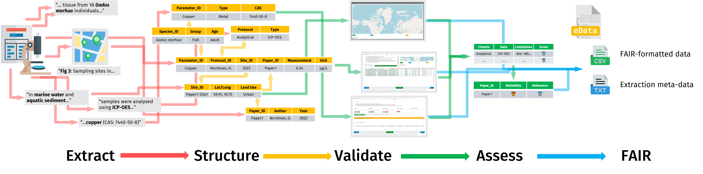
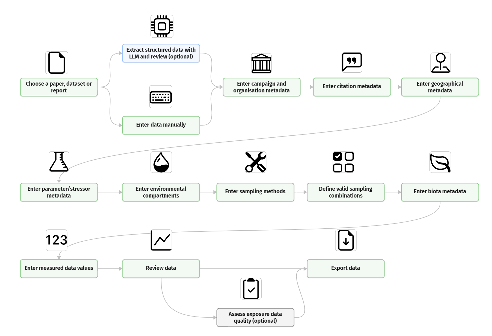

# STOPeData

STOPeData ("eData") is a data entry and formatting Shiny application (app) in the [Source to Outcome Pathway/Risk Assessment Database family](https://stop.niva.no/), designed to make extracting data on chemical concentrations in the environment from papers and reports easier.

::: {style="text-align: center"}
🖥️ [Test Version](https://edata.test-stop.niva.no) (NIVA login required) · 🖥️ [Prod](https://edata.stop.niva.no) (Login required) · 🪲 [Report Bug](https://github.com/NIVANorge/STOPeData/issues/new?labels=bug&template=bug-report---.md) · ❔[Request Feature](https://github.com/NIVANorge/STOPeData/issues/new?labels=enhancement&template=feature-request---.md)
:::

## Table of Contents

- [About The Project](#about-the-project)
  - [Built With](#built-with)
- [Getting Started](#getting-started)
  - [Prerequisites](#prerequisites)
  - [Installation](#installation)
- [Usage](#usage)
- [Roadmap](#roadmap)
- [Contact](#contact)
- [Acknowledgments](#acknowledgments)

## About The Project {#about-the-project}

{fig-alt="Flow diagram-style illustration of eData extraction process. Left to right, process is organised into Extract, Structure, Validate, Assess, FAIR. Extract shows snippets of text from a study (sampling sites, media, stressors, techniques, organisms). Structure shows same data organised into structured tables. Validate shows application UI used to validate data. Assess shows tables representing data quality scoring. FAIR shows output data format: csv and txt."}

This app is designed to guide users through the formatting, cleaning and annotation of exposure/pollution/monitoring data (e.g. mg/L of a chemical in an environmental matrix). Published studies and reports are an important source of this data, but it is often fragmented and difficult to analyse without extensive data cleaning and transformation. By assisting and automating this step, we hope to make exposure assessment - and therefore the risk assessment of chemicals in the environment - as easy as possible.

This app is part of the [Source to Outcome Pathway/Risk assessment database](https://www.niva.no/radb) family of R Shiny apps, and provides one-half of the data necessary for environmental risk assessment. Its counterpart for toxicity/bioassay data is [STOP qData](https://github.com/NIVANorge/stop-q-data). Environmental risk predictions can be viewed at the [Source To Outcome Predictor](https://github.com/NIVANorge/STOP).

### Built With {#built-with}

[](#)

<!-- badges: start -->
[](https://github.com/NIVANorge/STOPeData/actions/workflows/R-CMD-check.yaml)
[](https://app.codecov.io/gh/NIVANorge/STOPeData)
<!-- badges: end -->

## Getting Started {#getting-started}

### Prerequisites {#prerequisites}

- [R](https://www.r-project.org/about.html) version >=4.1.0 (currently built on 4.5.3)
- [pak](https://pak.r-lib.org/), for dependency installation

### Installation {#installation}

1. (Optional) Get an API key for LLM data extraction ([Anthropic](https://platform.claude.com/docs/en/get-api-key)/[OpenAI](https://platform.openai.com/api-keys)/[Google Gemini](https://aistudio.google.com/api-keys)), and [Zenodo](https://developers.zenodo.org/)/Zenodo Sandbox tokens for uploading to Zenodo.

2. Clone the repo, or install from GitHub:

   ```sh
   git clone https://github.com/NIVANorge/STOPeData.git
   ```

   ```r
   pak::pak("NIVANorge/STOPeData")
   ```

3. Install the companion schema package and the remaining dependencies:

   ```r
   pak::pak("NIVANorge/eDataDRF")   # companion schema package, must be installed separately
   pak::local_install_deps()        # or source dependencies.R for the full list
   ```

4. (Optional) Enter your API keys/tokens in your `.Renviron` file:

   ```
   ANTHROPIC_API_KEY="sk-ant-api03-..."
   OPENAI_API_KEY="..."
   GOOGLE_API_KEY="..."
   ZENODO_TOKEN="..."
   ZENODO_SANDBOX_TOKEN="..."
   ```

5. If you're developing on a fork, point `origin` at it to avoid accidental pushes to the base project:

   ```sh
   git remote set-url origin sawelch-NIVA/STOPeData
   git remote -v # confirm the change
   ```

6. Run the app locally (or use Docker):

   ```r
   golem::run_dev() # dev mode, more verbose
   shiny::runApp('app.R', host='0.0.0.0', port=3838) # prod mode
   ```

## Usage {#usage}

Run the application locally

### Diagrams



An overview of the manual/LLM assisted workflow.

## Roadmap {#roadmap}

See the [open issues](https://github.com/NIVANorge/STOPeData/issues) for a full list of proposed features (and known issues).

## Contact {#contact}

Sam Welch - sam.welch@niva.no

Project Link: <https://github.com/NIVANorge/STOPeData>

## Acknowledgments {#acknowledgments}

- Project Lead: Knut Erik Tollefsen
- Funding: [EXPECT](https://www.niva.no/en/projects/expect), [PARC](https://www.eu-parc.eu/), and [NCTP](https://www.niva.no/radb) Projects
- Testers: Li Xi, Knut Erik Tollefsen, Sophie Mentzel, Pierre Blévin, Camden Karon Klefbom
- Support and Advice: Viviane Giradin, Andrea Merlina, Kim Leirvik, Jemmima Knight, Malcolm Reid
- LLMs were used in the creation of this app and its code.
- Readme template repo: [Best-README-Template](https://github.com/othneildrew/Best-README-Template/blob/main/BLANK_README.md)
- (If I've left you off please let me know!)
